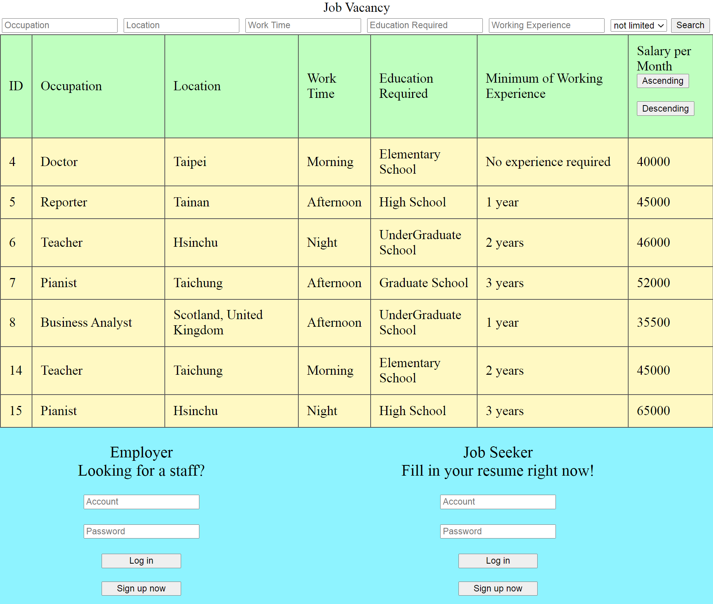
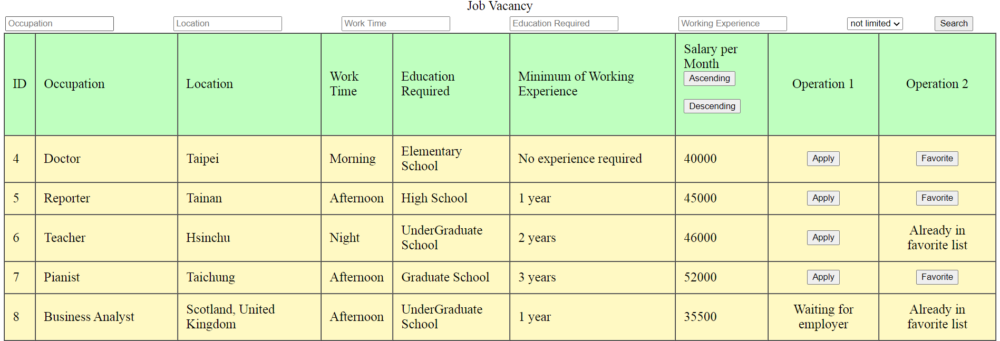
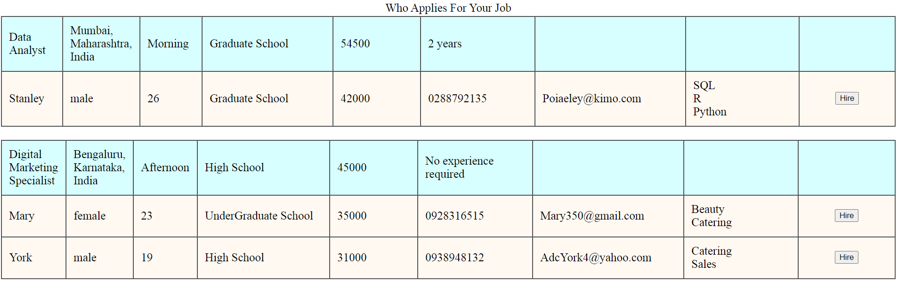

## Job Search Website
Job Search Website implemented using PHP, SQL, Apache, and MariaDB.

## Features
Job Seeker
- Register, log in/out

- Fill in resume

- View list of job vacancy, search based on multiple criteria, sort by salary

- Add job to favorite list, remove from list

- Apply for job

Employer
- Register, log in/out

- Post new job, edit job details, delete job

- View list of job vacancy, search based on multiple criteria, sort by salary

- View list of job seeker

- View application list

- Hire job seeker 

## Screenshots
Home page.

Search based on salary.

Job seeker - register, fill in resume.

Job seeker - apply for job, add to favorite.

Job seeker - favorite list.

Employer - edit job details.

Employer - view job applications, hire job seeker.

